<a href="https://levvolkov.github.io/" target="_blank">
<picture>
  <source media="(prefers-color-scheme: dark)"  srcset="https://github.com/user-attachments/assets/f25235f0-3a56-4d1a-8424-a880d912fb96">
  <source media="(prefers-color-scheme: light)" href="https://github.com/user-attachments/assets/92ca76d7-810c-4c7c-9290-9aa9fcdd2e8d">
  
</picture>
</a>

***
 Меня зовут Лев, и я начинающий специалист в тестировании программного обеспечения. В процессе обучения на курсе «Инженер по тестированию» на образовательной платформе [Нетологии](https://netology.ru/programs/qa-middle#/main) я познакомился с техниками тест-дизайна, работал с Selenide и изучал методологию BDD, создавая качественные тесты на основе пользовательских сценариев. Занимался тестированием с использованием Playwright и Espresso, автоматизацией кроссплатформенных приложений с UI Automator и Appium, а также реализовал систему отчетности Allure для отображения результатов тестирования. Кроме того, проводил нагрузочное тестирование с использованием BlazeMeter и JMeter и настраивал мониторинг с помощью Telegraf, InfluxDB и Prometheus. Моя цель — обеспечить высокое качество цифровых продуктов и внести вклад в развитие команды и проекта. 
***

 
 
 

-----

<!-- Ручное тестирование веб-приложений -->

<table align="left" width="100%" >
  <tr>
    <td align="left" width="100%" >

             

*<h3 align="center"><a href="https://docs.google.com/spreadsheets/d/12FRLL7s3RniGDJEYNHwJRhJukKVNMLrJR4868zy6Hds/edit?gid=347591775#gid=347591775" title="repository lists"> «Ручное тестирование   веб-приложений» </a></h3>*

  &nbsp;
  &nbsp;
 

*
*

*
 Изученный материал 
*

*<table border="0" align="center">*
	<tr>
                <td>

		*
 «Методы и виды тестирования» 
*</td>
	</tr>
        <tr>
               <td>*
 «Тестирование ПО. Тест-дизайн» 
*</td>
	</tr>
        <tr>
               <td>*
 «Артефакты тестирования. Тестовая документация» 
*</td>
	</tr>
        <tr>
               <td>*
 «Артефакты тестирования. Дефекты» 
*</td>
	</tr>
        <tr>
               <td>*
 «Инструменты тестирования для работы с документацией» 
*</td>
	</tr>
        <tr>
               <td>*
 «Основы клиент-серверного взаимодействия» 
*</td>
	</tr>
        <tr>
               <td>*
 «Особенности тестирования web-приложений и работа с Chrome» 
*</td>
	</tr>
        <tr>
               <td>*
 «Инструменты тестирования. Клиент-Сервер» 
*</td>
	</tr>
        <tr>
               <td>*
 «Жизненный цикл разработки ПО. Гибкие методологии разработки ПО» 
*</td>
	</tr>
        <tr>
               <td>*
 «Курсовой проект: проведение тестирования сайта крупной компании» 
*</td>
	</tr>
        <tr>
	        <td>*
«<a href="https://docs.google.com/spreadsheets/d/1izwdoHvAUXkukRRkRCoaPGdZd58F3e-VzDqhPq9L9ys/edit?usp=sharing"> Чеклист 
                <a/>   для функциональной проверки личного кабинета зарегистрированного   авторизованного  пользователя, включая функционал разделов, 
                  на сайте Henderson »
*</td>
	</tr>
        <tr>
	        <td>*
«<a href="https://docs.google.com/spreadsheets/d/1G3ZCS60na-KQbO-MeoA0ctaEfOO8Q-_NehnNrnrAL6g/edit?usp=sharing"> Набор 
                тест-кейсов </a>   на проверку функционала восстановление пароля »
*</td>
	</tr>
        <tr>
	        <td>*
«<a href="https://docs.google.com/spreadsheets/d/1AtjTjpJy5xd7R1_6svUvym4Pxv-HdDvtYA7a-Rwi2S0/edit?usp=sharing"> Баг- 
                репорты </a>   на основе скриншота »
*</td>
	</tr>
        <tr>
	        <td>*
«<a href="https://docs.google.com/document/d/1tFmdkzxJWfE0AnDIqFiGZpvuboc3EqbBWGtiQaJtZg4/edit?usp=sharing"> 
                Тестирование верстки </a>   страницы карточки товара с максимальной и минимальной ценой »
*</td>
	</tr>
        <tr>
	        <td>*
«<a href="https://docs.google.com/document/d/1XnjWPBnY48-4_957HTD_KNQv_oRo1oMqW7xYP8lB6WU/edit?usp=sharing"> Клиент сервер </a>   ищем запрос, в котором есть нужные параметры, найти, как же выглядят параметры   deviceUUID, requestID и status »
*</td>
	</tr>
        <tr>
	       <td>  
<a href="https://netology.ru/sharing/258baa3ed45659f21616886d99969b52?utm_source=social&utm_campaign=certificate_lms">
		 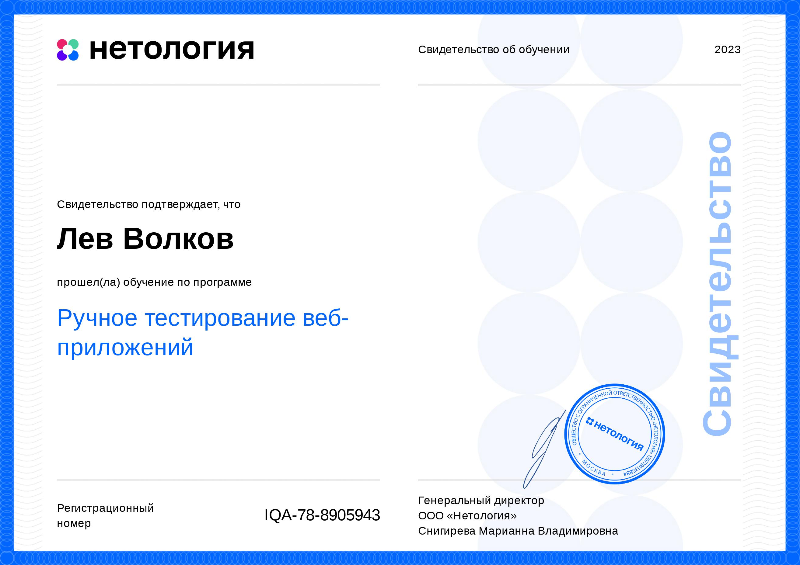</a> &nbsp; 
           <a href="https://github.com/levvolkov/levvolkov/blob/master/assets/Certificate/TouchTyping.jpg">
	        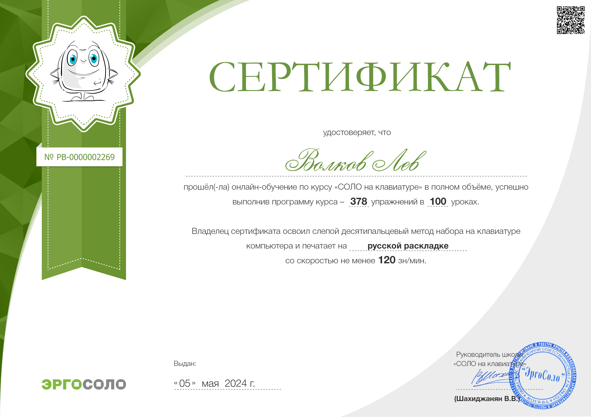</a>
 </td>

              
 </tr>
</table>

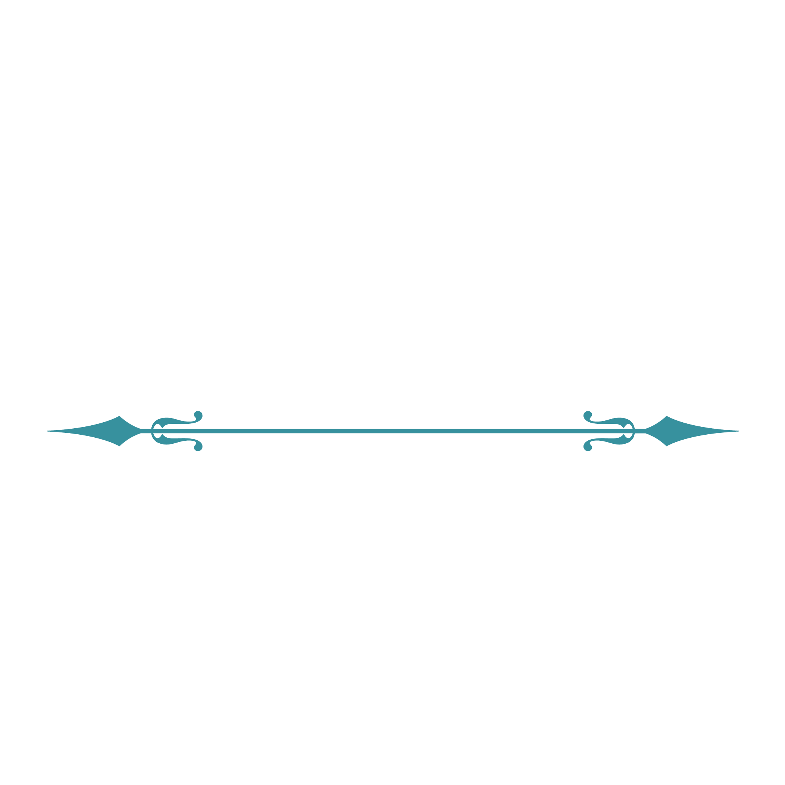             

 

</td>
</tr>
</table>

<!-- Git-система контроля версий --> 

<table align="right" width="100%" >
  <tr>
    <td align="right" width="100%" >

             

*<h3 align="center"><a href="https://github.com/netology-code/guides/blob/master/git-basics/GitMaterialsAll.md">  «Git-система   контроля версий» </a></h3>*

  &nbsp;
  &nbsp;
 
 <a href="https://support.apple.com/ru-ru/guide/terminal/trmld4c92d55/mac#gh-light-mode-only" title="Terminal">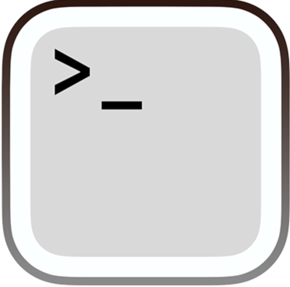</a>
 

*
*

*
 Изученный материал 
*

*<table border="0" align="center">*
	<tr>
               <td>

                *
«Предназначение системы контроля версий»
*</td>
	</tr>
        <tr>
	       <td>*
«Основные операции (фиксация и откат изменений, поиск, история)»
*</td>
	</tr>
        <tr>
	       <td>*
«Работа с сервисом GitHub»
*</td>
	</tr>
        <tr>
	       <td>*
«Ветки, слияние веток и разрешение конфликтов»
*</td>
	</tr>
        <tr>
	       <td>*
«Командная работа»
*</td>
	</tr>
         <tr>
	       <td>  
<a href="https://netology.ru/sharing/c937b576d959591795bae25f62ac2130?utm_source=social&utm_campaign=certificate_lms">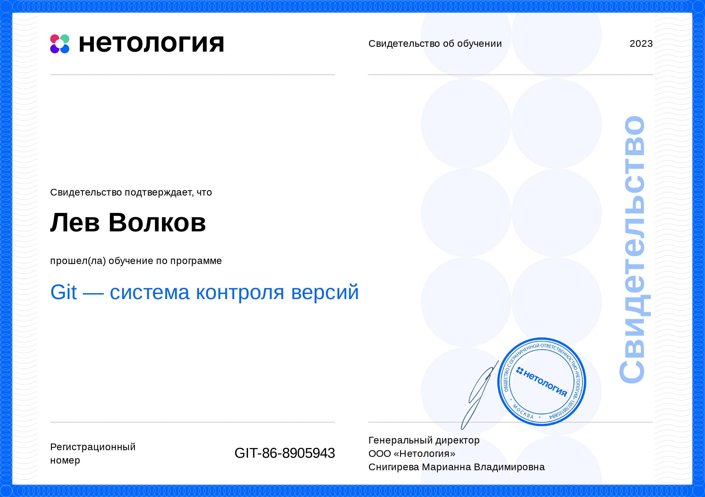</a>
 </td>
 </tr>
  </table>
  

             

 

</td>
</tr>
</table>

<!--Java для тестеровщиков-->

<table align="left" width="100%" >
  <tr>
    <td align="left" width="100%" >

 

             

*<h3 align="center"><a href="https://github.com/stars/levvolkov/lists/java-for-testers"> «Java для   тестировщиков» </a></h3>*

   &nbsp;
   &nbsp;
   &nbsp;
  
   

*
*

*
 Практическая работа 
*

*<table border="0" align="center">*
	<tr>
                <td>

                *
<a href="https://github.com/levvolkov/javaqa1"> 1. «Введение в Java» </a>
		
 Был версионирован проект с помощью Git и написан баг-репорт в GitHub Issues.
*</td>
	</tr>
	<tr>
		<td>*
<a href="https://github.com/LevVolkov/javaqa2"> 2.1 «Примитивные типы данных и условные  операторы» </a>
	         <a href="https://github.com/levvolkov/javaqa3"> 2.2 «Примитивные типы данных и условные операторы» </a>
                
Использование условных операторов. 
*</td>
	</tr>
	<tr>
		<td>*
<a href="https://github.com/LevVolkov/Testability1"> 3.1 «Testability. Введение в ООП» </a>
                 <a href="https://github.com/levvolkov/testability2"> 3.2 «Testability. Введение в ООП» </a>
		 <a href="https://github.com/levvolkov/testability3"> 3.3 «Testability. Введение в ООП» </a>
                
Сервисные классы для многофайловой программы. 
*</td>
	</tr>
	<tr>
		<td>*
<a href="https://github.com/levvolkov/maven"> 4. «Система сборки Maven»</a>

		
Создание maven-проекта, написание юнит-тестов с помощью JUnit 5. 
*</td>
	</tr>
	<tr>
		<td>*
<a href="https://github.com/levvolkov/packagesAndCycles"> 5. «Пакеты и циклы» </a>

		
 Использование циклов в программах, практика с пакетированием классов. 
*</td>
        </tr>
	<tr>
		<td>*
<a href="https://github.com/levvolkov/stringsAndArrays"> 6. «Строки и массивы»</a>

		
Циклы для работы с массивами.
*</td>
	</tr>
	<tr>
                <td>*
<a href="https://github.com/levvolkov/jacoco-ci"> 7. «Выстраивание процесса непрерывной интеграции» </a>

		
Настроен CI на основе GitHub Actions.
*</td>
	</tr>
	<tr>
		<td>*
<a href="https://github.com/levvolkov/objectOrientedProgrammingPrinciples"> 8. «Объектно-ориентированное программирование: 
                ключевые принципы» </a>

		
Объекты для хранения данных.
*</td>
	</tr>
	<tr>
		<td>*
<a href="https://github.com/levvolkov/radio"> 9. «Объектно-ориентированное программирование и проектирование» </a>

		
Объекты имеющие и поля, и методы.
*</td>
	</tr>
	<tr>
		<td>*
<a href="https://github.com/levvolkov/radio"> 10. «Объекты с внутренним состоянием, управление состоянием при тестировании» </a>

		
Управление начальным состоянием объектов через конструкторы.
*</td>
	</tr>
	<tr>
		<td>*
<a href="https://github.com/levvolkov/mockito"> 11. «Композиция и зависимость объектов. Mockito при создании автотестов» </a>

		
 Классы, внутреннее состояние которых содержит наборы данных.
*</td>
	</tr>
	<tr>
		<td>*
<a href="https://github.com/levvolkov/inheritanceIssues"> 12. «Наследование и расширяемость систем. Проблемы наследования» </a>

		
Связывание классов отношением наследования, переопределение методов в классах   наследников, с использованием полиморфизма классов.
*</td>
        </tr>
	<tr>
		<td>*
<a href="https://github.com/levvolkov/exceptionSituations"> 13. «Исключительные ситуации и их обработка. Тестирование 
                исключений» </a>

		
Добавление логики исключений в приложении, тестирование логики исключений в  приложении.
*</td>
		</tr>
	<tr>
		<td>*
<a href="https://github.com/levvolkov/sortAndCompare"> 14. «Интерфейсы для организации малой связности. Обобщённое  
                программирование (Generics)» </a>

		
Сортировка объектов, сравнение объектов с помощью Comparable и Comparator.
*</td>
		</tr>
	<tr>
		<td>*
<a href="https://github.com/levvolkov/useCollections"> 15. «Collections Framework. CRUD и тестирование систем, управляющих 
                 набором объектов» </a>

		
Использование коллекции для работы с наборами элементов.
*</td>
		</tr>
	<tr>
		<td>*
<a href="https://github.com/DenIvanof/javaqa-team-diplom-2"> Командный проект по курсу «Java для тестировщиков» </a>

		
Проведено тестирование приложения для работы с банковскими счетами.   Составлены баг-репорты на найденные баги. 
                Закрыты баг-репорты составленные коллегой, предварительно исправив баги.
*</td>
		</tr>
        <tr>
	       <td>  
<a href="https://netology.ru/sharing/b9e5fe9f0fb3dbb1bf14fb74bc8a19b5?utm_source=social&utm_campaign=certificate_lms">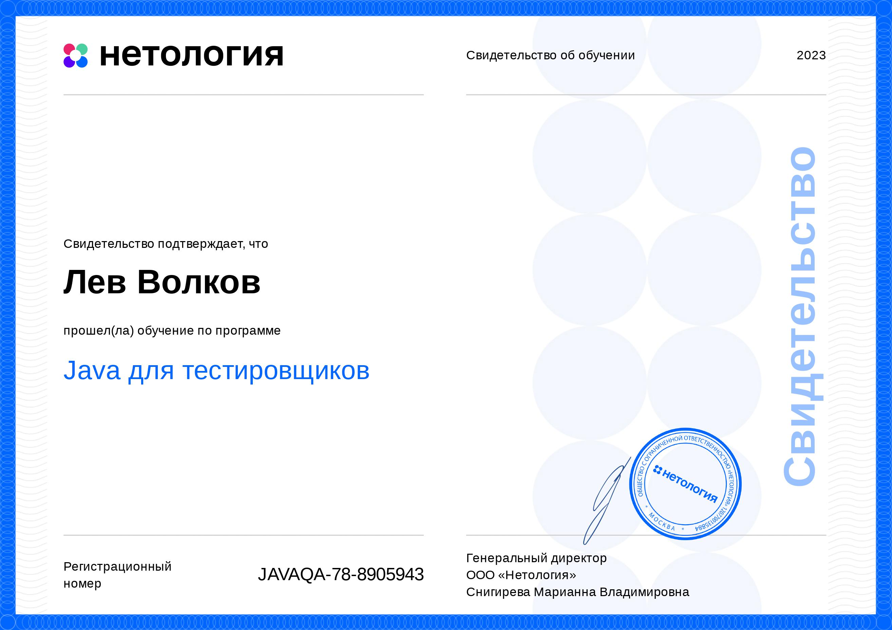</a>
 </td>
	</tr>
  </table>

             

             

</td>
</tr>
</table>

<!-- Автоматизированное тестирование -->

<table align="right" width="100%" >
  <tr>
    <td align="right" width="100%" >

             

*<h3 align="center"><a href="https://github.com/stars/levvolkov/lists/automated-testing"> «Автоматизированное  тестирование» </a></h3>*

   
   &nbsp;
   
   &nbsp;
   &nbsp;
   &nbsp;
   &nbsp;
   

*
*

*
 Практическая работа 
*

*<table border="0" align="center">*
	<tr>
                <td>

		*
<a href="https://github.com/levvolkov/cashBackHacker"> 1. «Основы автоматизации» </a>
 
                
Создание проекта на базе Gradle, не добавляя в него внешних зависимостей. 
*</td>
        </tr>
        <tr>
               <td>*
<a href="https://github.com/levvolkov/API-CI"> 2.1 «Тестирование API, CI» </a>

	       
Настройка AppVeyor, тренировка с Get запросами. 
*</td>
	</tr>
        <tr>
               <td>*
<a href="https://github.com/levvolkov/postmanEcho"> 2.2 «Тестирование API, CI» </a>

	       
Тренировка с Post запросами, отправка тела запроса. 
*</td>
	</tr>
        <tr>
               <td>*
<a href="https://github.com/levvolkov/testingWeb"> 3. «Тестирование веб-интерфейсов» </a>

	       
Автоматизация тестирования формы заказа карты с использованием Selenium,   библиотеки Webdriver Manager. 
*</td>
	</tr>
        <tr>
               <td>*
<a href="https://github.com/levevvolkov/selenide"> 4. «Selenide» </a>

	       
 Автоматизация тестирования формы заказа доставки карты   с использованием Selenide. 
*</td>
	</tr>
        <tr>
               <td>*
<a href="https://github.com/levvolkov/patterns1"> 5.1 «Patterns» </a> 
	       <a href="https://github.com/levvolkov/patterns2"> 5.2 «Patterns» </a>

	       
Реализация классов датагенератор, использование библиотеки Faker для генерации  данных, библиотеки Gson чтобы иметь возможность сериализовать Java-объекты   в JSON, использование Lombok. 
*</td>
	</tr>
        <tr>
               <td>*
<a href="https://github.com/levvolkov/pageObject"> 6. «BDD (Behaviour Driven Development), Page Object's» </a>

	       
Проработан класс DataHelper и пейдж объекты, реализовано достаточное   количество тестов, заведен репорт на обнаруженный дефект.
*</td>
	</tr>
        <tr>
               <td>*
<a href="https://github.com/levvolkov/dockerPostgreSQL"> 7. «Docker PostgreSQL» </a>

	       
Настроен контейнер, установлены параметры для запуска приложения. 
*</td>
	</tr>
        <tr>
               <td>*
<a href="https://github.com/levvolkov/SQL_deadline"> 8. «SQL» </a>

	       
Реализован класс датахелпера, пейдж объекты, спомогательный   класс взаимодействия с базой данных. 
*</td>
	</tr>
        <tr>
               <td>*
<a href="https://github.com/levvolkov/allureReport"> 9. «Репортинг Allure» </a>

	       
Подключен Allure, настроена интеграция с Selenide. 
*</td>
	</tr>
        <tr>
	       <td>*
<a href="https://github.com/levvolkov/testPlan"> 10. «Заключительная лекция» </a>

	       
 Написан план автоматизации тестирования сценария перехода к форме записи   и заполнения этой формы.
*</td>
	</tr>
        <tr>
	       <td>*
<a href="https://github.com/levvolkov/course-work"> Курсовой проект по модулю «Автоматизация тестирования»   для профессии «Инженер по тестированию» </a>

	       
 Автоматизация тестирования комплексного сервиса, взаимодействующего   с СУБД и API банка. 
*</td>
	</tr>
        <tr>
	       <td>  

 </td>
	</tr>
</table>

  

             

             

</td>
</tr>
</table>

<!--JavaScript для тестеровщиков-->

<table align="left" width="100%" >
  <tr>
    <td align="left" width="100%" >

 

             

*<h3 align="center"><a href="https://github.com/stars/levvolkov/lists/javascript-for-testers"> «JavaScript для   тестировщиков» </a></h3>*

  &nbsp;
 
  &nbsp;
  &nbsp;
  &nbsp;

*
*

*
 Практическая работа 
*

*<table border="0" align="center">*
	<tr>
                <td>

                *
<a href="https://github.com/levvolkov/bjs-2-homeworks/tree/main/1.base-concepts"> «Основные понятия» </a>

		
 Написана программа для решения квадратных уравнений и калькулятор для расчёта   выплат по ипотеке. 
*</td>
	</tr>
        <tr>
	       <td>*
<a href="https://github.com/levvolkov/bjs-2-homeworks/tree/main/2.functions"> «Функции» </a>

	       
 Написана функция `getArrayParams(...arr)`, которая получает на вход числа, а   возвращает минимальное, максимальное и среднее арифметическое значений массива. 
*</td>
	</tr>
        <tr>
	       <td>*
<a href="https://github.com/levvolkov/bjs-2-homeworks/tree/main/3.arrays"> «Массивы» </a>

	       
 Создана функция `compareArrays(arr1, arr2)`, которая с помощью функции высшего   порядка сравнивает значения двух массивов. А так же создана функция   `getUsersNamesInAgeRange(users, gender)`, которая возвращает среднее   значение возраста пользователей одного пола. 
*</td>
	</tr>
        <tr>
	       <td>*
<a href="https://github.com/levvolkov/bjs-2-homeworks/tree/main/4.objects"> «Объекты» </a>

	       
 Инкапсулирована логика работы со студентами в объекты, чтобы можно было   создавать студентов, устанавливать им предмет, добавлять оценки,   считать средний балл и отчислять.
*</td>
	</tr>
        <tr>
	       <td>*
<a href="https://github.com/levvolkov/bjs-2-homeworks/tree/main/5.classes"> «Классы» </a>

	       
 Перевод небольшой районной библиотеки в современный цифровой формат,   с помощью классов. Описаны возможные печатные издания, которые бывают   в библиотеке,  реализована возможность хранить книги, выдавать их   читателям и принимать обратно. 
*</td>
	</tr>
        <tr>
	       <td>*
<a href="https://github.com/levvolkov/bjs-2-homeworks/tree/main/6.exception-closure"> «Обработка исключений и замыкания» </a>

	       
 Написана функция-преобразователь, которая возвращает число, если всё   корректно и генерирует ошибку, если ввод не является числом в десятичной   системе счисления. Создан калькулятор треугольников, который сможет   проверять существование треугольника, считать площадь и периметр.
*</td>
	</tr>
        <tr>
	       <td>*
<a href="https://github.com/levvolkov/bjs-2-homeworks/tree/main/7.async"> «Асинхронность» </a>

	       
 Написана программа-будильник-колыбельная с возможностью добавления,   удаления, запусков и остановки звонков. 
*</td>
	</tr>
        <tr>
	       <td>*
<a href="https://github.com/levvolkov/bjs-2-homeworks/tree/main/8.decorators"> «Декораторы» </a>

	       
 Написан усовершенствованный кеширующий декоратор `cachingDecoratorNew`,   который кеширует только последние пять различных вызовов функции.   Усовершенствован debounce декоратор, добавлены три дополнительные фичи. 
*</td>
	</tr>
	<tr>
	       <td>  
<a href="https://netology.ru/sharing/4833730109b391a904155a6b1e1c93f2?utm_source=social&utm_campaign=certificate_lms ">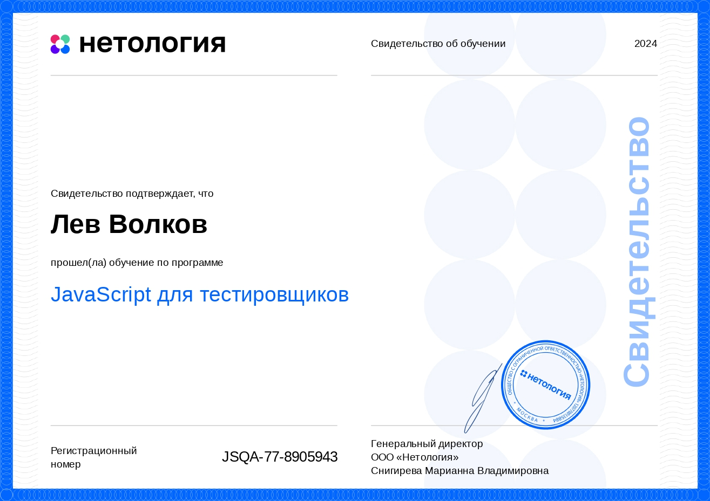</a>
 </td>
	</tr>
  </table>

             

             

</td>
</tr>
</table>

<!-- Автоматизация тестирования веб-интерфейсов -->

<table align="right" width="100%" >
  <tr>
    <td align="right" width="100%" >

             

*<h3 align="center"><a href="https://github.com/stars/levvolkov/lists/testing-web-interfaces"> «Автоматизация тестирования   веб-интерфейсов» </a></h3>*

 <a href="https://nodejs.org/en/download/package-manager" title="Node.js">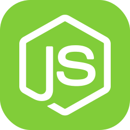</a> &nbsp;
  &nbsp;
  &nbsp;
 <a href="https://pptr.dev/" title="Puppeteer">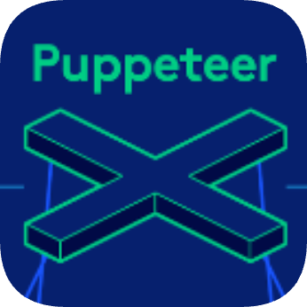</a> &nbsp;
  &nbsp;
  

*
*

*
 Практическая работа 
*

*<table border="0" align="center">*
	<tr>
                <td>

		*
<a href="https://github.com/levvolkov/setting-up-the-debugger"> 1. «Использование JS в браузере. Тестирование, дебагинг» </a>
 
                
 Настроен debugger в VSCode. 
*</td>
        </tr>
	 <tr>
	       <td>*
<a href="https://github.com/levvolkov/eslint-and-prettier"> 2. «Node.js» </a>

	       
 Установлен nvm пакет изменений версий Node.js, настроены плагиноы ESLint и Prettier. 
*</td>
	</tr>
         <tr>
	       <td>*
<a href="https://github.com/levvolkov/framework-jest"> 3.1 «Jest» </a>

	       
 Установлен и настроен феймворк Jest в проекте,   дописан недостоющий тест для 100% покрытия по всем параметрам. 
*</td>
	</tr>
         <tr>
	       <td>*
<a href="https://github.com/levvolkov/ui_test_on_playwright"> 3.2 «Playwright» </a>

	       
 Установлен  и настроен фреймворк Playwright в проекте,   созданы два UI-теста на успешную и неуспешную авторизацию на сайте netology.ru,   добавлена функция скриншота. 
*</td>
	</tr>
        <tr>
	       <td>*
<a href="https://github.com/levvolkov/puppeteer"> 4. «Puppeteer 1» </a>

	       
 Добавлены к существующим и помещены за блоком `describe` три теста,   которые проверяют заголовки на других страницах приложения.
*</td>
	</tr>
         <tr>
	       <td>*
<a href="https://github.com/levvolkov/puppeteer-cucumber"> 5. «Puppeteer 2» </a>

	       
 Написаны 2 happy path теста и 1 — sad path с использованием custom commands.   Организован BDD подход для тестов, подключен фреймворк Cucumber к проекту,   написан сценарий и шаги. 
*</td>
	</tr>
         <tr>
	       <td>*
<a href="https://github.com/levvolkov/cypress"> 6. «Cypress 1» </a>

	       
 Написано 6 тестов для проверки авторизации в приложении книг и   проверки функциональности работы с книгами в избранном,   повторяющиеся шаги вынесены в кастомные команды.   В конфигурациях настроены параметры `view-port` двух разных размеров экрана.   Для упрощения работы с запуском тестов настроены 4 скрипта   для запуска в режимах headded и headless. 
*</td>
	</tr>
         <tr>
	       <td>*
<a href="https://github.com/levvolkov/dashboard-cypress-swagger"> 7. «Cypress 2» </a>

	       
 Написаны тесты проверки логина в админку и   бронирования фильма в доступный зал приложения 'Идем в кино'.   Проект подключен к Dashboard-Cypress. Написан набор    интеграционных тестов на работу серверного API для проекта Swagger. 
*</td>
	</tr>
         <tr>
	       <td>*
<a href="https://github.com/levvolkov/dashboard_cypress_jenkins"> 8. «CI/CD Jenkins» </a>

	       
 Добавлены скрипты и параметры для запуска тестов в   трёх разных браузерах и для запуска тестов параллельно,   чтобы два разных потока запускались в двух разных браузерах.   Настроен Jenkins добавлен новый параметр браузеров и   секретного ключа для запуска тестов.
*</td>
	</tr>
       <tr>
	       <td>  
<a href="https://netology.ru/sharing/b8bb2c4405f05e8f7b1bd6c247496f00?utm_source=social&utm_campaign=certificate_lms ">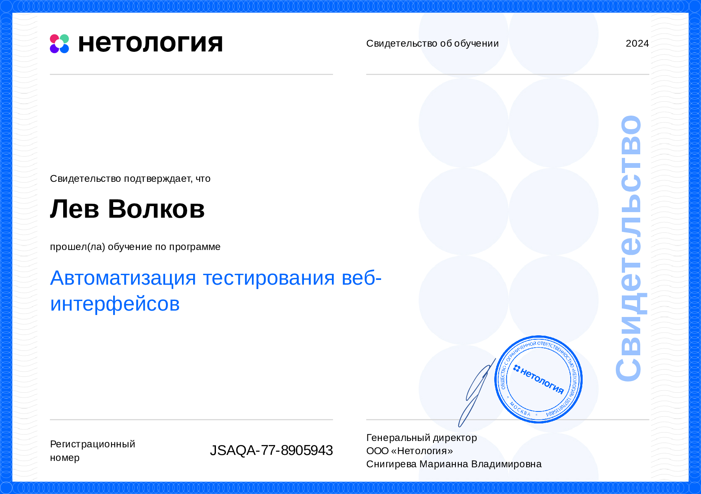</a>
 </td>
	</tr>
</table>

  

             

             

</td>
</tr>
</table>

<!--Tестирование мобильных приложений-->

<table align="left" width="100%" >
  <tr>
    <td align="left" width="100%" >

 

             

*<h3 align="center"><a href="https://github.com/stars/levvolkov/lists/mobile-application-testing"> «Тестирование мобильных   приложений» </a></h3>*

 &nbsp;
 &nbsp;
 &nbsp;
<a href= "https://developer.apple.com/xcode/#gh-dark-mode-only" title= "Xcode">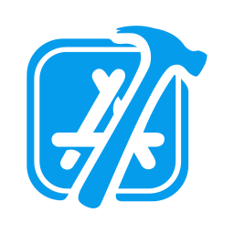</a>
<a href= "https://developer.apple.com/xcode/#gh-light-mode-only" title= "Xcode">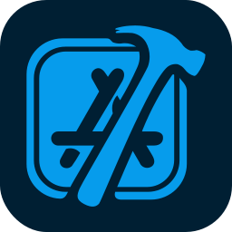</a> &nbsp;
 &nbsp;

*
*

*
 Практическая работа 
*

*<table border="0" align="center">*
	<tr>
                <td>

                *
<a href="https://docs.google.com/spreadsheets/d/1iz0vPOJ5_xcfblLF7E60baIL4NNThj4tXaYuG9UHFIo/edit?usp=sharing"> 1. «Ручное тестирование мобильных приложений. Введение» </a>

		   
 На основе предварительных исследований был составлен чек-лист проверок для   приложения "Онлайн-кинотеатр". Приложение Everybook было подвергнуто   тестированию, в ходе которого были обнаружены баги и составлен детализированный   баг-репорт. Подготовлен краткий отчет о тестировании сервиса, в который будет   интегрирована платежная система Stripe. В отчете описаны процедуры тестирования   платежей на финальной и тестовой версиях мобильного приложения на iOS.
*</td>
	</tr>
        <tr>
	       <td>*
<a href="https://docs.google.com/spreadsheets/d/1sG0z-49ipb3OXa5K3sTrvRDiYk6XXjZm/edit?usp=sharing&ouid=103433639670438982387&rtpof=true&sd=true"> 2. «Тестирование iOS-приложений» </a>

	       
 Выполнен анализ различных версий iOS, начиная с iOS 13, а также требований Apple   к приложениям для восстановления старого приложения. Проведен подробный анализ   несовместимостей приложения Ad Workout X с гайдлайнами App Store. Сформированы   и переданы тимлиду iOS-разработки данные, необходимые для добавления нового   тестового устройства в TestFlight. Присоединился к бета-тестированию приложения   iT-TecNews через TestFlight и обновил его до последней версии сборки.
*</td>
	</tr>
        <tr>
	       <td>*
<a href="https://docs.google.com/spreadsheets/d/1fzeTYIpz5NqCU230l6h3ZB8MQafeRpho/edit?usp=sharing&ouid=103433639670438982387&rtpof=true&sd=true"> 3. «Тестирование Android-приложений» </a>

	       
 Выявлены возможные причины задержки в определении геолокации в новом   приложении для геокешинга и описаны начальные шаги для диагностики данной   проблемы. Создан чек-лист для тестирования подписок в новом Android-приложении   для музыкального стриминга, использующего подписочную модель монетизации.   В меню разработчика на устройстве Android были активированы различные   функции с пояснением их полезности для проведения тестирования. 
*</td>
	</tr>
        <tr>
	       <td>*
<a href="https://docs.google.com/spreadsheets/d/180YBsppMg1BG2p0yez07eexjpVOU1_WC/edit?usp=sharing&ouid=103433639670438982387&rtpof=true&sd=true"> 4. «Виды тестирования в контексте мобильных устройств» </a>

	       
 Определены виды тестирования, необходимые для различных сценариев.   Установлены пять основных причин, препятствующих успешной регистрации   пользователей в приложении с большим числом установок, но низким уровнем   зарегистрированных пользователей. Описаны шаги, которые следует предпринять   в случае, если приложение соответствует бизнес-требованиям, но пользователи   воспринимают это как баг. Проведены проверки на доступность для людей   с ограниченными возможностями.
*</td>
	</tr>
        <tr>
	       <td>*
<a href="https://docs.google.com/spreadsheets/d/1fFLpiMfJj9Qsx-S8gLbolnI_MjbiuLwj/edit?usp=sharing&ouid=103433639670438982387&rtpof=true&sd=true"> 5. «Выбор устройств для тестирования» </a>

	       
 Были определены подходящие устройства для тестового случая на основе   проведенного исследования, учитывающего финансовые условия и особенности    целевого рынка. Выявлены критерии, при которых оптимально использовать   эмулятор, симулятор или реальное устройство. 
*</td>
	</tr>
        <tr>
	       <td>*
<a href="https://docs.google.com/spreadsheets/d/1SL7IK_GoM817jKF0ck0ws2PPWI9tLCan/edit?usp=sharing&ouid=103433639670438982387&rtpof=true&sd=true"> 6. «Инструменты для тестирования мобильных приложений. Среда разработки» </a>

	       
  Установил Homebrew для macOS и Linux, что позволило установить Android Debug   Bridge (ADB) на macOS. С его помощью провел стресс-тестирование и получил   логи тестируемого Android приложения. Проанализировал стектрейсы ошибок и   выдвинул предположения о затронутых модулях приложения  и возможных   действиях пользователя, вызвавшиx ошибки. 
*</td>
	</tr>
        <tr>
	       <td>*
<a href="https://github.com/levvolkov/setting-up-android-studio"> 2.1 «Автоматизация тестирования мобильных приложений» </a>

	       
 Установлен Android Studio. Настроена конфигурация файловой среды на   macOS (zsh), которая устанавливает переменные окружения для разработки   приложений  на платформе Android и работы с Java. Эта конфигурация корректно   настраивает пути к Android SDK и JDK, упрощая их использование. Запущен   склонированный проект на эмуляторе. Проверена работоспособность приложения   на реальном физическом  устройстве, подключенном через USB, для обнаружения   возможных различий в поведении по сравнению с эмулятором. Проверен   функционал приложения, в котором реализовано переключение между   вкладками. Написан автотест с помощью Espresso Test Recorder. 
*</td>
	</tr>
        <tr>
	       <td>*
<a href="https://github.com/levvolkov/ui_automator_android_testing"> 2.2 «UI Automator. Автоматизация тестирования Android» </a>

	       
 В рамках проделанной работы было написано два теста: первый тест проверяет   попытку установки пустой строки в поле ввода, а второй — открытие текста   в новой Activity. После выполнения тестов были настроены автоматизированные   проверки с использованием GitHub Actions. 
*</td>
	</tr>
         <tr>
	       <td>*
<a href="https://github.com/levvolkov/XCTest_ios_automation"> 2.3 «XCTest. Автоматизация тестирования iOS-приложений» </a>

	       
  Установлена и настроена среда разработки Xcode. Добавлены UI-тесты для   iOS-приложения с использованием библиотеки XCTest. Реализованы основные   тесты, включая проверку активности кнопки "Login" и соответствие логина на   экране профиля логину, который пользователь ввёл при повторном входе. Все   тесты успешно прошли, обеспечивая стабильность функционала приложения. 
*</td>
	</tr>
         <tr>
	       <td>*
<a href="https://github.com/levvolkov/appium"> 2.4 «Appium. Кроссплатформенная мобильная автоматизация тестирования» </a>

	       
 В рамках задачи по настройке окружения для работы с Appium был установлен   Appium и его зависимости. Проведен анализ системных зависимостей с помощью   Appium Doctor, что обеспечило корректную работу платформы. Также был   установлен Appium Inspector для удобной работы с элементами интерфейса   приложений и разработаны тесты для проверки установки пустой строки   и открытия текста в новой Activity. 
*</td>
	</tr>
         <tr>
	       <td>*
<a href="https://github.com/levvolkov/espresso"> 2.5 «Espresso. Автоматизация тестирования Android» </a>

	       
 Склонирован и запущен тестовый проект в Android Studio, настроена библиотека   Espresso для тестирования. Реализован тест для проверки главного экрана   приложения с использованием Espresso. Экспортирован отчет теста в HTML-файл.   Также добавлена интеграция Allure для генерации отчетов о тестировании и   покрытия большинства потребностей. Отчеты успешно загружены в раздел   Issues репозитория.
*</td>
	</tr>
         <tr>
	       <td>*
<a href="https://github.com/levvolkov/espresso-advanced-automation"> 2.6 «Espresso. Продвинутая автоматизация тестирования Android» </a>

	       
 Настроены библиотеки Espresso, позволяющие эффективно тестировать   пользовательский интерфейс Android-приложений, используя механизмы работы   с Intents и асинхронными операциями через Idling Resources. Проработаны оба   варианта реализации интентов, что значительно улучшило интеграцию тестов   с функциональностью приложения. Также реализованы собственные ViewMatcher   и ViewAssertions для проверки состояния UI-элементов, что обеспечивает   уверенность в корректной работе приложения.
*</td>
	</tr>
        <tr>
	       <td>  
<a href="https://netology.ru/sharing/e59ac85386036d491aec49758e94fbd1?utm_source=social&utm_campaign=certificate_lms ">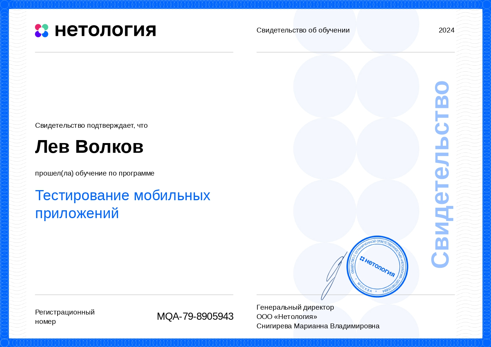</a>
 </td>
	</tr>
  </table>

             

             

</td>
</tr>
</table>

<!-- Тестирование производительности -->

<table align="right" width="100%" >
  <tr>
    <td align="right" width="100%" >

             

*<h3 align="center"><a href="https://github.com/stars/levvolkov/lists/performance-testing"> «Тестирование   производительности» </a></h3>*

 <a href="https://www.blazemeter.com/" title="BlazeMeter">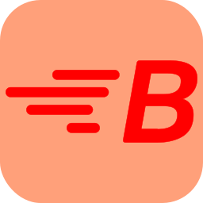</a> &nbsp;
  &nbsp;
 
  &nbsp;
  &nbsp;
  &nbsp;
 
  

*
*

*
 Практическая работа 
*

*<table border="0" align="center">*
	<tr>
                <td>

		*
<a href="https://docs.google.com/document/d/1Em4pLeK8PbdaPNe7ljZcIG30dS4UrKbfS_V6pbslkZ0/edit?usp=sharing"> 1. «Введение в нагрузочное тестирование» </a>
 
                
 Подготовлен список ключевых вопросов для менеджера проекта, чтобы уточнить   требования и сценарии использования сайта в период повышенной активности,   а также оценены потребности в оборудовании для нагрузки. В результате,   определены виды тестирования, включая нагрузочное и стресс-тестирование,   с составлением соответствующего плана тестирования для обеспечения   стабильности веб-интерфейса в условиях ожидаемого наплыва пользователей.
*</td>
        </tr>
	 <tr>
	       <td>*
<a href="https://github.com/levvolkov/load_testing_stand"> 2. «Подготовка стенда нагрузочного тестирования» </a>

	       
 Успешно развернута система мониторинга на базе Telegraf и InfluxDB, а также   Node Exporter и Prometheus с последующим подключением графиков в Grafana.   Настроены параметры отправки метрик: для Telegraf — каждые 60 секунд, а   для Prometheus — каждые 36 секунд, включая мониторинг оперативной памяти,   swap, жесткого диска и сетевых метрик. Проведён тест на отображение всех   аппаратных метрик сервера, и сделаны скриншоты состояния  системы   в покое, продолжительностью не менее 15 минут. 
*</td>
	</tr>
         <tr>
	       <td>*
<a href="https://github.com/levvolkov/load_testing_web"> 3. «Проведение нагрузочного тестирования WEB» </a>

	       
 Были успешно осуществлены два раунда тестирования. В первом раунде был   написан сценарий тестирования добавления комментария на сайт WordPress   через BlazeMeter. Во втором раунде был реализован сценарий тестирования   покупки билета и получения QR-кода через систему JMeter. 
*</td>
	</tr>
	<tr>
	       <td>*
<a href="https://github.com/levvolkov/database_load_testing"> 4. «Проведение нагрузочного тестирования DB» </a>

	       
 Успешно запущено склонированное приложение с использованием   Docker-контейнеров и обеспечено подключение к базе данных MariaDB с   помощью DBeaver. Проведены замеры времени отклика для хранимых   процедур dorepeat_v1 и dorepeat_v2, результаты показали, что процедура   dorepeat_v2 работает дольше, чем dorepeat_v1 из-за своей более сложной   структуры. Установлены соответствующие графики и проведен их анализ. 
*</td>
	</tr>
        <tr>
	       <td>*
<a href="https://github.com/levvolkov/load_testing_report"> 5. «Подготовка отчёта о тестировании и завершение проекта» </a>

	       
 Проведено тестирование системы сайта WordPress с использованием JMeter   для симуляции нагрузки и проверки производительности при записи данных.    Для этого были применены хранимые процедуры, предназначенные для   автоматического добавления комментариев в базу данных. Тестирование   позволило оценить поведение системы при записи данных без взаимодействия   с пользовательским интерфейсом. На основе полученных результатов был   составлен отчет, подтверждающий, что система обеспечивает заявленную   производительность. 
*</td>
	</tr>
         <tr>
	       <td>  
<a href="https://netology.ru/sharing/8e5c486bd68deff7244eae2a1899b814?utm_source=social&utm_campaign=certificate_lms">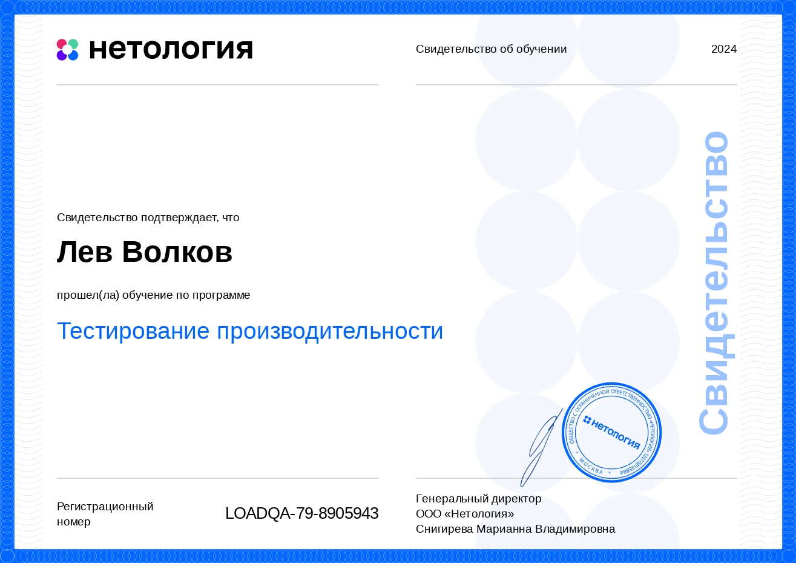</a>
 </td>
	</tr>
</table>

  

             

             

</td>
</tr>
</table>

<!--Тестирование безопасности-->

<table align="left" width="100%" >
  <tr>
    <td align="left" width="100%" >

 

             

*<h3 align="center"><a href="https://drive.google.com/drive/folders/13WwzvX6rmyKC4ib0mx3K6SPYqDA3A2-j?usp=sharing"> «Тестирование безопасности» </a></h3>*

  
 &nbsp;
 
 &nbsp;
<a href="https://nmap.org/download.html" title="Nmap">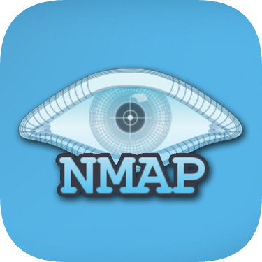</a>

*
*

*
 Практическая работа 
*

*<table border="0" align="center">*
            <tr>
                <td>

		*
<a href="https://docs.google.com/document/d/19te7JdB-GlipGd1BA3xDcYtmaCmnWhb18S-rb_0YTlY/edit?usp=sharing">1 «Введение в тестирование безопасности»</a>
 
                
Были установлены необходимые инструменты: Wireshark, Firefox и   OWASP ZAP, что позволило начать работу с анализаторами сетевого   трафика. В процессе выполнения практических заданий осуществлен   захват трафика, проанализированы протоколы UDP и DNS, а также   выполнено исследование веб-сайта с  помощью ZAP.
*</td>
         </tr>
         <tr>
	       <td>*
<a href="https://docs.google.com/document/d/1I5dqb_TUl040UsESU-gQinqBF5bxK_Q7NSczRVR5Xu4/edit?usp=sharing"> 2 «Инъекции и уязвимости на уровне ОС»</a>

	       
Разработан план тестирования приложения, сосредоточенный на двух   полях: числовом и символьном. Для числового поля проверяли   переполнение на предельных значениях, а для символьного — обработку   входных данных и защиту от переполнения буфера. Также предложен   Whitelist для символьного поля, ограничивающий допустимые символы,   чтобы минимизировать риски атак.
*</td>
	</tr>
        <tr>
	       <td>*
<a href="https://docs.google.com/document/d/1IY21DXI-FMcwTMIfRrC9ZggV9Fa22BMRVpStZZmavTw/edit?usp=sharing">3 «SQL, XSS, Code и другие инъекции»</a>

	       
 Составлен план тестирования карточки товара, направленный на выявление   уязвимостей XSS и SQL-инъекций. Проверка включает тестирование   полей ввода на возможность выполнения вредоносного кода и манипуляции   с запросами к базе данных, с акцентом на фильтрацию и экранирование   входящих данных для предотвращения потенциальных атак. 
*</td>
	</tr>
        <tr>
	       <td>*
<a href="https://docs.google.com/document/d/1Tquxr9WOq_HkjO-JY-fr5dvMqUg4EnUO-4Y2wYMZnWM/edit?usp=sharing">4 «Сетевая безопасность»</a>

	       
 Установлено приложение Nmap и выполнено сканирование хоста   scanme.nmap.org для определения запущенных сетевых служб   и операционной системы. Результаты анализа показали наличие   четырех служб и определили, что веб-сервером является Apache   httpd версии 2.4.7, работающий на одной из версий Linux. 
*</td>
	</tr>
        <tr>
	       <td>  
<a href="https://netology.ru/sharing/497bb9b7eb340d7596d58f2a54cc7b33?utm_source=social&utm_campaign=certificate_lms">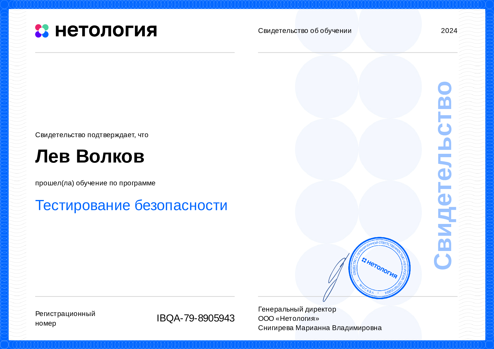</a>
 </td>
	</tr>
  </table>

             

             

</td>
</tr>
</table>

<!-- Дипломный проект -->

<table align="right" width="100%" >
  <tr>
    <td align="right" width="100%" >

             

*<h3 align="center"><a href="https://github.com/levvolkov/diplomaProject-QA"> Дипломный проект по профессии   «Инженер по тестированию» </a></h3>*

 &nbsp;
 &nbsp;

*
*

*
 Дипломная работа 
*

*<table border="0" align="center">*
        <tr>
                <td>

		*
   Тестовая документация на проекте:
*</td>
	</tr>
         <tr>
	       <td>*
<a href="https://github.com/levvolkov/diplomaProject-QA/blob/main/documentation/Plan.md"> «План по проверке и автоматизации приложения» </a>

	       
 
*</td>
	</tr>
        <tr>
	       <td>*
<a href="https://docs.google.com/spreadsheets/d/1tp4zuPhJCrSsRBF5NDZpXZ0Zf8EW4IJW4OcM2-sP4Pw/edit?usp=sharing"> «Чек-лист c отметками о пройденных и не пройденных тестах»</a>

	       
 
*</td>
	</tr>
        <tr>
	       <td>*
<a href="https://docs.google.com/spreadsheets/d/14wejW8lElOt6h5sYnSTjFMKYt1W6wXHiVvCJvYb8fsU/edit?usp=sharing"> «Тест-кейсы для проверки приложения»</a>

	       
 
*</td>
	</tr>
        <tr>
	       <td>*
<a href="https://github.com/levvolkov/diplomaProject-QA/issues"> «Баг-репорты с обнаруженными ошибками»</a>

	       
 
*</td>
	</tr>
       <tr>
	       <td>*
<a href="https://levvolkov.github.io/diplomaProject-QA/documentation/allure-report"> «Allure-отчет с результатами прогона авто-тестов»</a>

	       
 
*</td>
	</tr>
        <tr>
	       <td>*
<a href="https://github.com/levvolkov/diplomaProject-QA/blob/main/documentation/Result.md"> «Отчет о проведенном тестировании»</a>

	       
 
*</td>
	</tr>
        <tr>
        <td>  
<a href="https://netology.ru/sharing/7cd4d9407504fb43418ef84298810ac7?utm_source=social&utm_campaign=certificate_lms">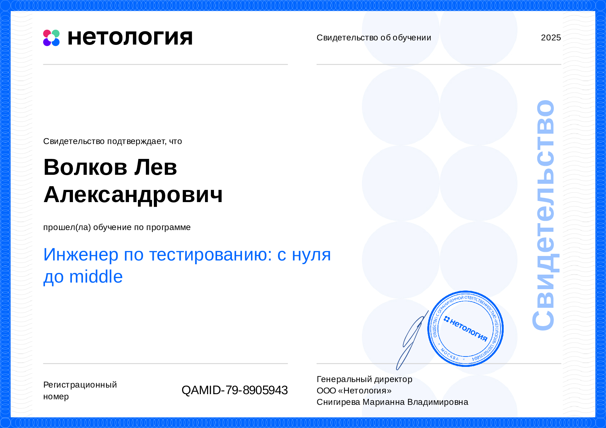</a>
 </td>
        </tr>
        <tr>
        <td>  
<a href="assets/Certificate/letter_of_recommendation.jpg">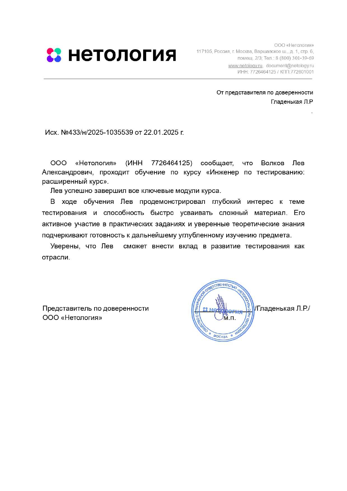</a>
 </td>
</tr>
</table>

             

             

</td>
</tr>
</table>

<!-- GitHub stats -->

<table>
  <tr align="center">
    <td>
      <picture>
        <source media="(prefers-color-scheme: dark)" srcset="https://github-readme-activity-graph.vercel.app/graph?username=LevVolkov&theme=react-dark&hide_border=true&hide_title=false&area=true&custom_title=Total%20contribution%20graph%20in%20all%20repositories&bg_color=FF000000&color=ffffff&title_color=006AFF&point=006AFF&line=006AFF&area_color=006AFF" />
        <source media="(prefers-color-scheme: light)" srcset="https://github-readme-activity-graph.vercel.app/graph?username=LevVolkov&theme=react-dark&hide_border=true&hide_title=false&area=true&custom_title=Total%20contribution%20graph%20in%20all%20repositories&bg_color=FF000000&color=000000&title_color=006AFF&point=006AFF&line=006AFF&area_color=006AFF" />
        
      </picture>
    </td>
  </tr>
</table>

<table align="right" width="100%">
  <tr>
    <td align="right" width="100%">

             

      
<picture>
  <source media="(prefers-color-scheme: dark)" srcset="https://github-readme-stats-one-bice.vercel.app/api?username=LevVolkov&theme=transparent&show_icons=true&count_private=true&hide_border=true&text_color=c9d1d9&icon_color=006AFF&title_color=006AFF" />
  <source media="(prefers-color-scheme: light)" srcset="https://github-readme-stats-one-bice.vercel.app/api?username=LevVolkov&theme=transparent&show_icons=true&count_private=true&hide_border=true&text_color=000000&icon_color=006AFF&title_color=006AFF" />
  
</picture>

             

      
   </td>
  </tr>
</table>

<table align="left" width="100%">
  <tr>
    <td align="left" width="100%">

             

 
 

             

  </td>
</tr>
</table>

<table align="right" width="100%">
  <tr>
    <td align="right" width="100%">

             

      
<picture>
  <source media="(prefers-color-scheme: dark)" srcset="https://github-profile-trophy.vercel.app/?username=levvolkov&theme=dark_dimmed&no-frame=true&column=3&row=2&no-bg=true" />
  <source media="(prefers-color-scheme: light)" srcset="https://github-profile-trophy.vercel.app/?username=levvolkov&theme=flat&no-frame=true&column=3&row=2&no-bg=true" />
  
</picture>

             

      
 </td>
  </tr>
</table>

<table align="left" width="100%">
  <tr>
    <td align="left" width="100%">

             

      
 <picture>
  <source media="(prefers-color-scheme: dark)" srcset="https://github-readme-stats.vercel.app/api/top-langs/?username=LevVolkov&layout=donut&theme=transparent&show_icons=true&count_private=true&hide_border=true&&text_color=ffffff&&title_color=006AFF" />
  <source media="(prefers-color-scheme: light)" srcset="https://github-readme-stats.vercel.app/api/top-langs/?username=LevVolkov&layout=donut&theme=transparent&show_icons=true&count_private=true&hide_border=true&&text_color=000000&&title_color=006AFF" />
  
</picture>

             

 </td>
  </tr>
</table>

<table>
  <tr align="center">
    <td>  
      <picture>
        <source media="(prefers-color-scheme: dark)" srcset="https://github-profile-summary-cards.vercel.app/api/cards/productive-time?username=LevVolkov&theme=github_dark&utcOffset=3" />
        <source media="(prefers-color-scheme: light)" srcset="https://github-profile-summary-cards.vercel.app/api/cards/productive-time?username=LevVolkov&theme=github&utcOffset=3" />
        
      </picture>
      <picture>
        <source media="(prefers-color-scheme: dark)" srcset="https://github-profile-summary-cards.vercel.app/api/cards/profile-details?username=LevVolkov&theme=github_dark&hide_border=true" />
        <source media="(prefers-color-scheme: light)" srcset="https://github-profile-summary-cards.vercel.app/api/cards/profile-details?username=LevVolkov&theme=github&hide_border=true" />
        
      </picture>
    </td> 
  </tr>
</table>